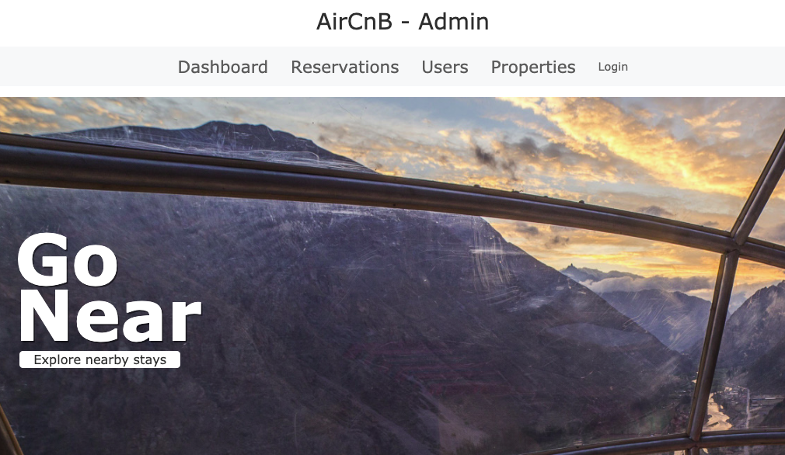
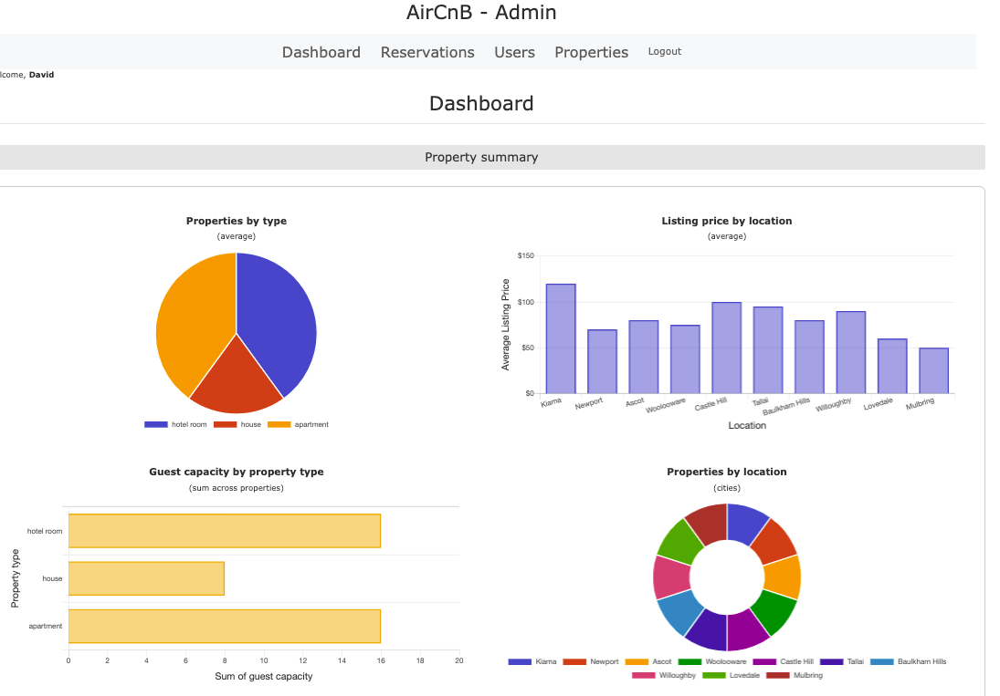
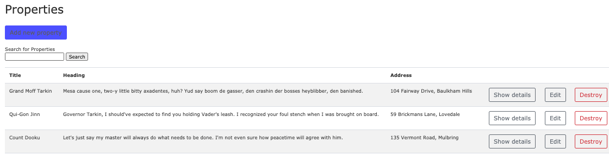
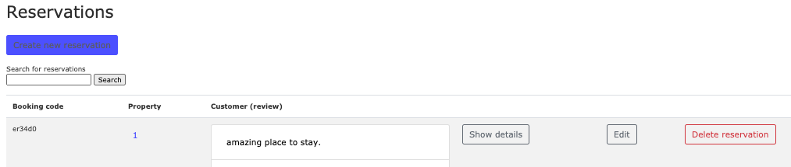
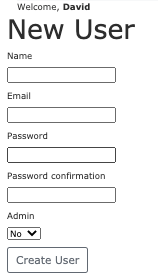

AirCnB
-----------------------------------------------------

This is a group project and is a reservation platform to book accommodation around Australia.

links
------------------------------------------------------
Github Rails code: https://github.com/staceyrea/rails-air-cnb-app
Github React code: https://github.com/staceyrea/react-air-cnb-app
Live demo (Heroku-rails): https://air-bnb-replication.herokuapp.com/
Live demo (Gitgub-react): https://staceyrea.github.io/react-air-cnb-app/#/

Tech stack used
------------------------------------------------------

React
PostgreSQL
RoR
CSS
Bootstrap
Braintree
APIs
JSON
AXIOS
Geolocation
ActionMailer

How to use
------------------------------------------------------

AirCnB is a platform with properties around Australia for rent. Ruby on Rails (the backend) is for the admin to use while React (the frontend) is for the users to place reservations and leave reviews of the properties.

This is the homepage:

If Admin logins it can access all the features such as stats:

properties:

reservations:

and can add new properties, reservations or users:

Known bugs
------------------------------------------------------
TBA

Future features
------------------------------------------------------
User will be able to favourite Properties
